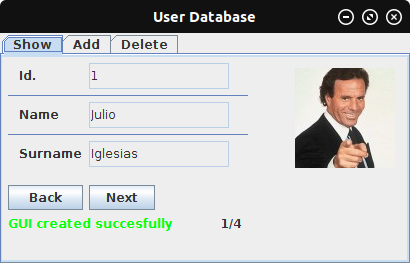
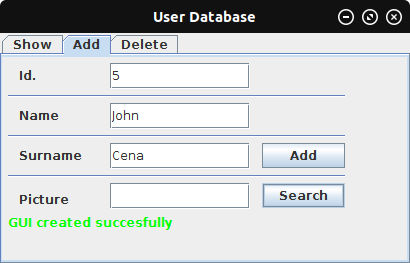
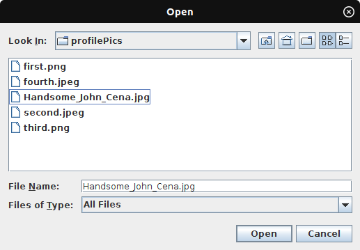
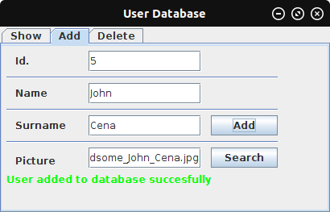
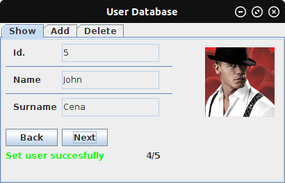
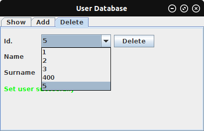
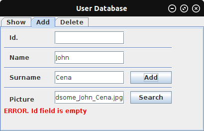
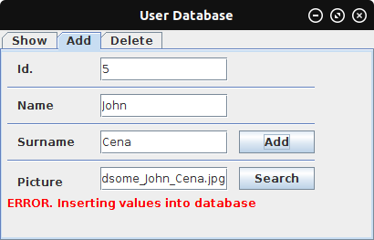

# User-Database-GUI
An interactive GUI made with Java using JFormDesigner that controls a SQLite database

* Shows all users in DB

* Add users

* (Optional) Attaching profile pictures stored in DB

 

* Delete any user stored

* Show any error in the main GUI

